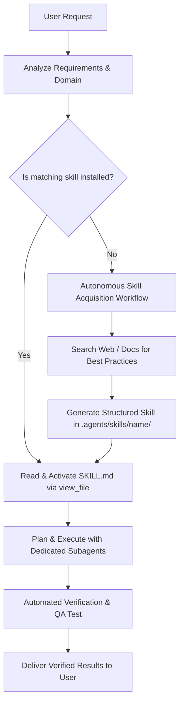

# Autonomous Skill Manager & Skill Orchestrator

This skill enables Antigravity to act as an autonomous skill orchestrator: dynamically assessing what skills are needed, activating existing skills, sourcing/downloading missing skills from online documentation/repositories, and scaffolding new, high-performance skills into `.agents/skills/`.

---

## 1. Core Operating Principles

1. **Intelligent Progressive Activation**: Never guess when domain knowledge is available. Always scan available skills in `<skills>` and immediately inspect `SKILL.md` for relevant domains before writing code.
2. **Dynamic Skill Acquisition**: If a task involves a new framework, API, toolchain, or library (e.g., modern Web APIs, specialized PyQt techniques, cloud services, external SDKs), autonomously research and create a standardized skill under `.agents/skills/<skill-name>/SKILL.md`.
3. **Multi-Skill Synthesis**: Seamlessly combine instructions from multiple skills (e.g., combining UI architecture, animation physics, and automated QA testing).
4. **Subagent Specialization**: When executing complex or multi-faceted tasks, define and launch specialized subagents equipped with relevant skill instructions.

---

## 2. Dynamic Workflow



---

## 3. Autonomous Skill Acquisition Procedure

When a task requires a skill not currently in the workspace or global configuration:

### Step 1: Research & Extract Knowledge
1. Search official documentation, GitHub repositories, and best practices using `search_web` or `read_url_content`.
2. Extract:
   - Core API signatures and imports.
   - Recommended architecture and state management patterns.
   - Anti-patterns and known crash/conflict hazards.
   - Ready-to-use boilerplate and test recipes.

### Step 2: Scaffold the New Skill
Create the skill directory structure in `.agents/skills/<skill-name>/`:
```text
.agents/skills/<skill-name>/
├── SKILL.md          # Required: YAML frontmatter + structured runbook
├── scripts/          # Optional: Python/PowerShell automation helpers
└── references/       # Optional: In-depth API tables and cheatsheets
```

### Step 3: Write Standardized `SKILL.md`
Ensure the YAML frontmatter contains:
```markdown
---
name: <kebab-case-name>
description: >-
  Clear, third-person description of what the skill does and exactly when to activate it.
---

# <Skill Title>

## Overview & Principles
...

## Step-by-Step Implementation Guide
...

## Code Patterns & Best Practices
...

## Verification & Testing Guide
...
```

### Step 4: Immediately Activate
Read the newly created `SKILL.md` using `view_file` and execute the task according to its guidelines.

---

## 4. Helper Scripts

This skill includes an automated Python utility located at [scripts/skill_manager.py](./scripts/skill_manager.py) to:
- List all currently available skills across workspace, global, and built-in paths.
- Search for skill keywords.
- Scaffold new skills from templates.
- Validate skill frontmatter and directory layout.

---

## 5. Subagent Dispatch Guidelines

When handling complex tasks:
1. **Research / Discovery**: Launch a `research` subagent to perform broad codebase inspection or web searching.
2. **Implementation**: Execute changes using precise file tools.
3. **Verification**: Always run an isolated verification script or subagent to test edge cases, focus handling, and lifecycle events before completing the turn.
