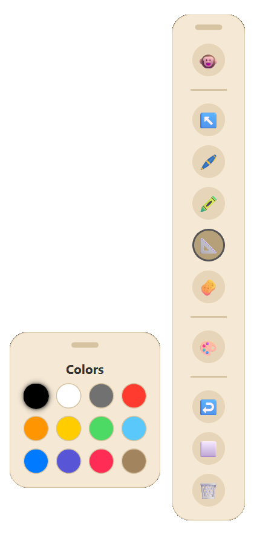

# Pen 11


A high-performance, lightweight, and completely free screen annotation tool built specifically and optimized for Windows 11. 



---

## 📖 Story & Motivation

> *"While taking my NIELIT 'O Level' course, I found myself in need of a good screen annotation tool. However, I quickly realized that most existing options were either locked behind paywalls, bloated with unnecessary features, or suffered from laggy, outdated user interfaces.*
> 
> *Frustrated by these limitations, I decided to build my own solution using AI. The result is **Pen 11**—a blazing-fast, highly responsive, and meticulously optimized screen marker that respects your system's resources. It is entirely free and open-source, allowing anyone in the community to use it, learn from it, or modify it to suit their own needs."*

---

## ✨ What's New in This Version: Features & Animation Suite

### 🎬 60 FPS Fluid Animation Engine
* **Smooth Toolbar Collapse / Expand:** When ink is hidden (or toggled via `Ctrl+5`), the toolbar collapses into a clean, minimal floating pill containing only the unhide button (`🙈`) and drag handle using `QPropertyAnimation` with cubic easing curves (`InOutCubic`, `240ms`). Expanding back restores full height with zero visual jumps or layout fighting.
* **Non-Blocking Opacity Transitions:** Floating sub-toolbars (Color Palette, Shapes Menu, Cursor Options) fade in and out using `InOutSine` easing (`150ms` / `120ms`). The animation dynamically reverses from the current opacity when toggled rapidly, completely eliminating snapping or flickering.

### 🪟 Independent Floating Sub-Toolbars & Smart Drag Persistence
* **Truly Independent Panels:** Color Palette, Shapes Menu, and Cursor Toolbars function as modular floating panels. Clicking the main toolbar surface will never close or reset your sub-toolbars.
* **Intelligent Drag Synchronization:** When dragging the main toolbar, attached sub-toolbars glide smoothly along with it without restarting animations. Once you independently drag a sub-toolbar to a custom screen position, it remembers its exact coordinates and stays anchored where you placed it.
* **Auto-Dismiss on Tool Switching:** Selecting a drawing tool (Pen, Highlighter, Eraser) cleanly dismisses temporary popups while keeping your Color Palette open for continuous work.

### 🖱️ Zero-Latency Hover & Cursor Engine
* **Native Mouse Tracking & Hover Detection:** Sub-toolbar buttons instantly update to `PointingHandCursor` and display crisp tooltips on hover without stealing window focus from your target applications (Word, browsers, presentations).
* **Multi-Click Responsiveness:** Rapidly clicking across color swatches or tool options remains 100% fluid with no cursor lockup or event dropping.

### 📐 Smart Objects & Pure Vector Selection
* **Oriented Bounding Box (OBB) Engine:** Selected strokes and shapes track their exact oriented geometry during rotation, dragging, and scaling.
* **Collision-Resistant Transform Handles:** Handle physics (Rotate, Delete, Scale) dynamically adjust spacing to prevent overlap on thin or elongated shapes.
* **Float-Precision Scaling:** Scaling objects maintains correct relative stroke widths without nib distortion.
* **Gesture-Based Geometric Detection:** Hold your pen for `400ms` at the end of a drawing stroke to automatically snap into perfect lines, circles, or ellipses.

### 💾 Persistent State & Single-Instance Safety
* **Built-in Storage Manager:** Automatically saves your custom pen/highlighter/eraser sizes, active colors, shape preferences, and toolbar screen coordinates to disk across sessions.
* **Single-Instance IPC Guard:** Inter-process communication via `QLocalServer`/`QLocalSocket` guarantees that only one instance of Pen 11 runs at a time, eliminating hotkey conflicts and duplicate processes.
* **Infinite Drawing & OOM Protection:** Handles up to `50,000` simultaneous strokes on screen with a massive `5,000`-step Undo stack.

---

## 💻 System Requirements

* **OS:** Windows 10 or Windows 11 (Heavily optimized for Windows 11 Desktop Window Manager & Per-Monitor V2 DPI).
* **RAM:** Minimum 50 MB of available memory.
* **Graphics:** Any GPU supporting Direct3D 11 (`QSG_RHI_BACKEND=d3d11`).
* **Python Runtime (for source):** Python 3.10+ (tested with Python 3.14) & PyQt6.

---

## 🚀 Installation & Usage

1. **Download:** Grab the latest `main.exe` / `Pen 11.exe` from the [Releases](https://github.com/Narayan6204/Epic-pen-clone-windows-11-optimised/releases/latest) page.
2. **Run Portable:** No installer required! Simply launch the executable.

### 📚 How to Use

* **The Main Toolbar:** Appears at the top-right of your screen. Drag it anywhere by its top pill handle or background.
* **Drawing Tools:** Click Pen (`Ctrl+1`), Highlighter (`Ctrl+2`), or Eraser (`Ctrl+3`). Long-press any tool button to open the instant line size selector.
* **Shapes Sub-Menu:** Click the Shape button (`📐`) to open the geometric palette (Line, Arrow, Rectangle, Rounded Rectangle, Circle, Triangle). Hold `Shift` while drawing for 1:1 square/circle aspect ratios or 45° angle snapping.
* **Colors Palette:** Click `🎨` (`Ctrl+P`) to toggle the 12-color floating palette. Drag it anywhere on screen.
* **Selection / Lasso Mode:** Click `↖️` or press `Ctrl+4`. Click an object or draw a lasso circle around multiple strokes to move, rotate, scale, or delete them.
* **System Tray:** Minimizes to the Windows System Tray with quick access to About, Clear Screen, and Exit.

---

## ⌨️ Complete Shortcut Guide

| Shortcut | Action |
| :--- | :--- |
| `Ctrl` + `1` | Select **Pen Tool** |
| `Ctrl` + `2` | Select **Highlighter Tool** |
| `Ctrl` + `3` | Select **Eraser Tool** |
| `Ctrl` + `4` | Select **Cursor / Selection Mode** (Lasso & Transform) |
| `Ctrl` + `5` | Toggle **Ink Visibility** (Collapses/Expands Toolbar) |
| `Ctrl` + `Z` | **Undo** last stroke |
| `Ctrl` + `Shift` + `C` | **Clear Screen** |
| `Ctrl` + `]` | **Increase** Tool Size |
| `Ctrl` + `[` | **Decrease** Tool Size |
| `Ctrl` + `P` | Toggle **Color Palette** |
| `Ctrl` + `B` | Toggle **Whiteboard / Blackboard / Transparent Mode** |
| `Ctrl` + `Q` | **Exit Application** |
| `Delete` / `Backspace` | Delete selected shape (in Selection Mode) |
| `Shift` + `Draw` | Snap to regular aspect ratio / 45° line angles |

---

## 🛠️ Developer & Build Guide

### Running from Source
```bash
# 1. Clone the repository
git clone https://github.com/Narayan6204/Epic-pen-clone-windows-11-optimised.git
cd "Epic-pen-clone-windows-11-optimised"

# 2. Install dependencies
pip install -r requirements.txt

# 3. Run the app
python main.py
```

### Compiling Standalone Executable
```bash
python -m PyInstaller main.spec --noconfirm
```
*The compiled binary will be placed directly in the `dist/` directory as `Pen 11.exe`.*

---

## 💖 Support & Donate

If you find Pen 11 helpful for your studies, teaching, or daily workflow and want to support its continued development, you can buy me a coffee by scanning the UPI QR code below!

**UPI ID:** `narayanadev@ptyes`

<p align="center">
  
</p>

---

## 📄 License & Credits

Released under the **MIT License**.

Developed with ♥ by **Narayan Dev**.
